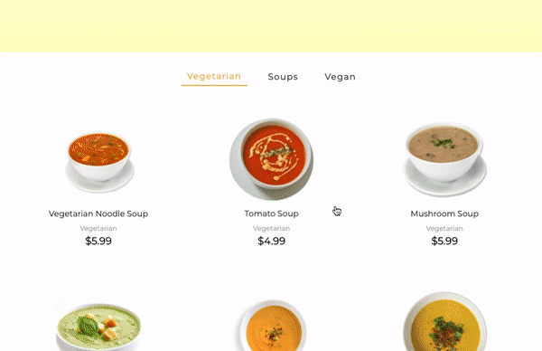

**The Soup Loop**

A full-stack Soup delivery web app where anyone can order their favorite soup from the menu and have options for vegetarian, vegan and regular soups. Users can order soups and pay online to receive the delivery while being home.

# Prototype
[Figma](https://www.figma.com/file/3ahSbwfsHFP0ZpDHDSXkoV/Soup-Theme?node-id=106%3A77)

# Demo

# Technology Used

## Frontend 
* React 
* React-Redux
* Styled-Components 
* React router

## Backend 
* Firebase authentication

## Setup
* yarn or npm install
* yarn or npm start

### Credit
Icons made by Freepik from www.flaticon.com
